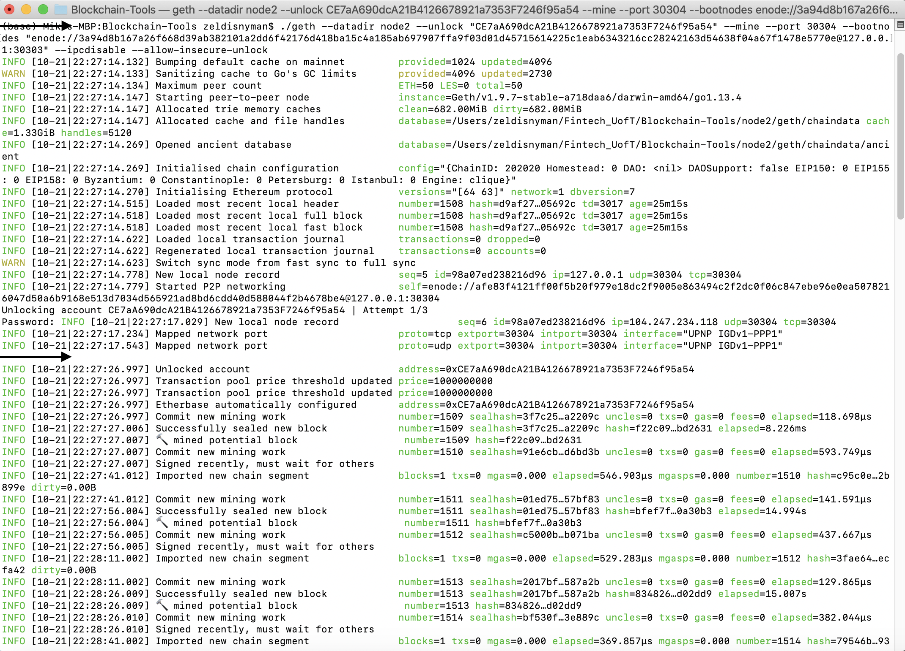
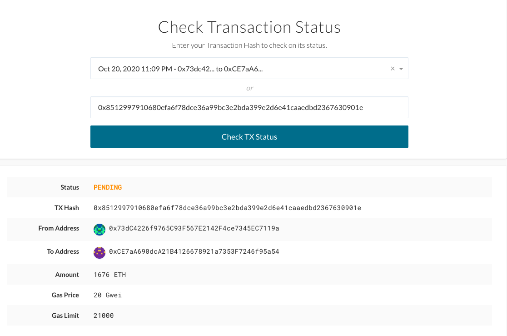

# Proof of Authority Development chain

## 1. Overview

This document provides instructions on how to use the private testnet blockchain to exlore potentials for utilizing blockchain at ZBank. It enables you to manage ethereum wallets and make transactions on the blockchain. The private testnet blockchain is used because it is free and it allows for offline development. 

The blockchain was set up using the following tools:
* Puppeth to generate a genesis block
* Geth to create keys, initialize nodes and connect the nodes together
* The Clique Proof of Authority algorithm

## 2. Initial set-up and installation requirements:
You will require some software tools and utilities to interact with the private testnet blockchain.
Complete the instructions below before interacting on the blockchain. Due to the fact that ZBank only uses Apple products, the instructions are only related to users of Mac.

### Installing MyCrypto Desktop App
To manage ethereum wallets and make transactions on the blockchainFor with the testnet blockchain, we will use MyCrypto Desktop App.  [MyCrypto](https://www.mycrypto.com/) is a free, open-source, client-side interface that allows you to interact directly with the blockchain.

To install MyCrypto Desktop App, please follow the next steps:

1. Open your browser and navigate to the downloads page at https://download.mycrypto.com/.

 

2. Once you download the installer, open the file, and follow the installation wizard. You will start using this application on Day 1.

MyCrypto General Notes:

* The first time you execute MyCrypto, you will see the following starting tutorial, we suggest you read through it as you click "Next" to continue.

 

* The first time you execute MyCrypto, you will see the following warning message. You can safely click on the "Open" button to start the application.

 

#### Allowing Permission to Open Apps from Unidentified Developers (Mac)  

In order to allow the use of the MyCrypto app, you may need to allow it as an exception to your Mac OS security preferences. To do so perform the following.

1. Open the MyCrypto app, it should produce a warning error saying that you cannot open the application due to security reasons. Therefore, we'll need to make a security exception for it.

2. Look to the top-left of the screen, click on the Apple Logo and navigate to System Preferences > Security & Privacy.

3. Click on the General tab and allow your MyCrypto application security access to be opened in the "Allow Apps Downloaded From" section. Your screen should look similar to the image below.  

### Installing Go Ethereum Tools

[Go Ethereum](https://geth.ethereum.org/) is one of the three original implementations of the Ethereum protocol. It is written in Go, fully open-source and licensed under the GNU LGPL v3.

Go Ethereum Tools will be used to to mining tokens and making transactions. 

To install the Go Ethereum Tools, please follow the next steps:

1. Open your browser and navigate to the Go Ethereum Tools download page at https://geth.ethereum.org/downloads/

2. Scroll down to the "Stable Releases" section and proceed depending on your operating system.

3. After downloading the tools archive, open your "Downloads" folder, and you will find a file named `geth-alltools-darwin-amd64-1.9.7-a718daa6.tar.gz`.

4. Decompress the archive in the location of your preference on your computer's hard drive.

### Genesis block settings
Puppeth was used to create the new blockchain, utilizing a Proof of Authority Algorithm. The following settings was applied in the setup of the block chain
   Network name: zblock
   Network id: 202020
   Blocktime: 15sec (default)
   Node 1 Public address of the key:   0x73dC4226f9765C93F567E2142F4ce7345EC7119a
   Node 1 self=enode://3a94d8b167a26f668d39ab382101a2dd6f42176d418ba15c4a185ab697907ffa9f03d01d45715614225c1eab6343216cc28242163d54638f04a67f1478e5770e@127.0.0.1:30303
   Node 2 Public address of the key:   0xCE7aA690dcA21B4126678921a7353F7246f95a54

## 3. Starting a chain

Open 2 seperate terminal windows to run the nodes:
1. Navigate to the folder where the installation was done, then run the following command:

    ./geth --datadir node1 --unlock "SEALER ONE ADDRESS" --mine --rpc --allow-insecure-unlock

 SEALER ONE ADDRESS: Is Node 1 public address of the key: : 73dC4226f9765C93F567E2142F4ce7345EC7119a - do not include leading 0x
 Type in password "rebecca" when prompted, however you will not see it visually when typing.

 * The --rpc flag enables us to talk to our second node, which will allow us to use MyCrypto
 * The --mine flag tells the node to mine new blocks.

 

 2. In the second terminal window, navigate to the folder where the installation was done and run the following command:

   ./geth --datadir node2 --unlock "SEALER_TWO_ADDRESS" --mine --port 30304 --bootnodes "enode://SEALER_ONE_ENODE_ADDRESS@127.0.0.1:30303" --ipcdisable --allow-insecure-unlock

 In this case it will look as follows with sealer 2 address and sealer one enode address populated:
 
   ./geth --datadir node2 --unlock "CE7aA690dcA21B4126678921a7353F7246f95a54" --mine --port 30304 --bootnodes "enode://3a94d8b167a26f668d39ab382101a2dd6f42176d418ba15c4a185ab697907ffa9f03d01d45715614225c1eab6343216cc28242163d54638f04a67f1478e5770e@127.0.0.1:30303" --ipcdisable --allow-insecure-unlock

 * The --bootnodes flag allows you to pass the network info needed to find other nodes in the blockchain. This will allow us to connect both of our nodes.

 Type in password "rebecca2" when prompted, however you will not see it visually when typing.

 

Using the first node as a bootnode will enable the nodes to communicate with each other, and discover new nodes later.
The chain will be up and running after you start the second node.

With both nodes running, the blockchain can be added to MyCrypto for testing.

## 4. Results from MyCrypto test
Below images show the transaction meta data for the transaction that was sent 

## 5. Files
All files are located in the folder POA_Development_Chain, which contains the following:
  * [Readme](README.md)
  * [Node 1 folder](node1)
  * [Node 2 folder](node2)
  * [blockchain json file](zblock.json)
  * [Images for readme](Images)
  * [Screenshots](Screenshots) associated with command prompt (puppeth and MyCrypto transaction)
